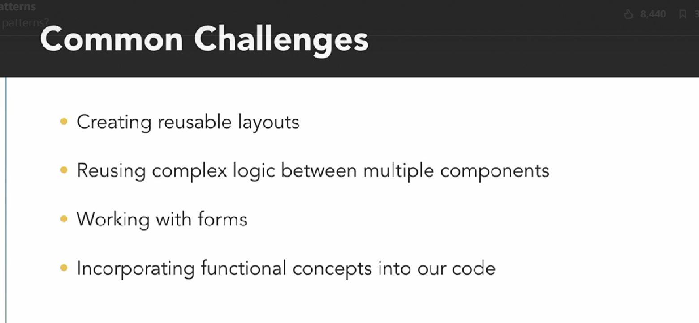
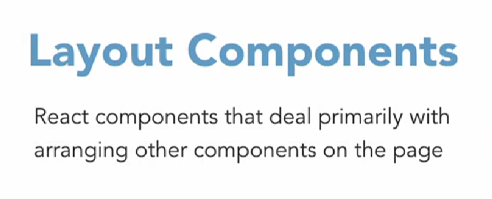
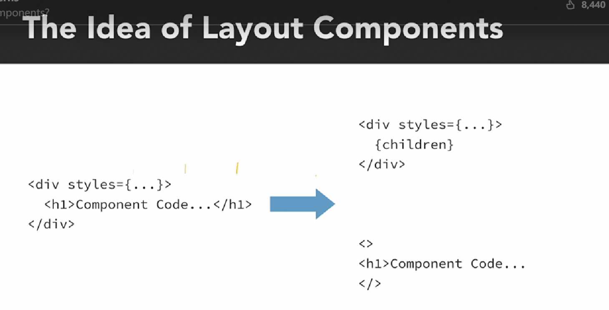
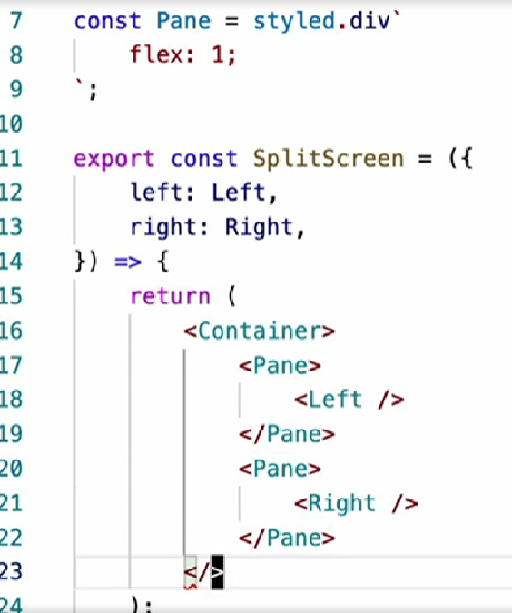

# Design Patterns

## 0. Concept
Design patterns are **effective** solutions to common application development challenges.

## 1. Layout Components

**The components shouldn't know where they will be placed.** (They are used in a layout wrapper.)

